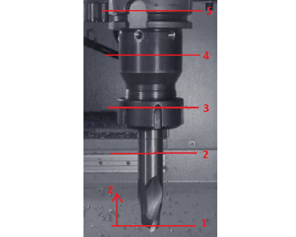
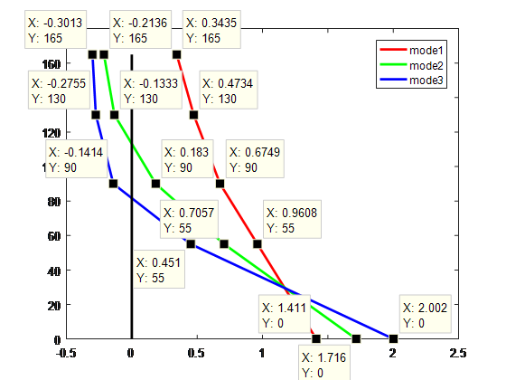

# Experimental Modal Analysis

Measured from the tool tip in axial $(z)$ direction, the approximate impact locations of the $5$ points are $0$, $55$, $90$, $130$ and $165$ mm. The vibration is measured at the tool tip (Point $1$) by an accelerometer.

<b>Points on the Tool</b>

In the five .txt files, the first column of each file is the frequency [Hz], second column is the real part of the computed $FRF$ [m/N], and the third column is the imaginary part of the computed $FRF$ [m/N].

For multi-degree freedom systems, the equation of motion in local coordinate system is given as:
$$m\ddot x = F - c\dot x - kx$$

or in matrix from:

$${[ {{M_x}} ]{ \{\ddot x} \} + [ {{C_x}} ]\{ {\dot x} \} + [ {{K_x}} ]\{ x \} = \{ F \}}$$

These equations are coupled and are cumbersome to solve for more than two degree of freedom systems, thus they are converted to modal coordinates as:

$$[ {{M_q}} ]\{ {\ddot q} \} + [ {{C_q}} ]\{ {\dot q} \} + [ {{K_q}} ]\{ q \} = \{ R \}$$

Where the modal mass, modal damping and model stiffness are separately:

$${[ M ]_q} = \{ P \}_k^T[ {{M_x}} ]{\{ P \}_k}$$

$${[ C ]_q} = \{ P \}_k^T[ {{C_x}} ]{\{ P \}_k}$$

$${[ K ]_q} = \{ P \}_k^T[ {{K_x}} ]{\{ P \}_k}$$

And $\{ P \}_k  $ is the Eigenvector (mode shapes)
The Frequency Response Function ($FRF$) of the system can be write as:

$$ [ {H(s)} ] = \frac{{\{ {X(s)} \}}}{{\{ {F(s)} \}}} $$

The element in row $i$ and column $l$ of $\left[ {H\left( s \right)} \right]$ matrix may be given as residues form:

$$ {h_{il}} = \sum\limits_{k = 1}^n {\left( {\frac{{{\alpha _{il,k}} + {\beta _{il,k}}s}}{{{s^2} + 2{\xi _k}{\omega _{n,k}}s + \omega _{n,k}^2}}} \right)} $$

Where $n$ – number of modes.

The mode shapes are found from the estimated residues. Displacement vector can be expressed by its mode shapes and modal transfer functions.

$$\{ x \} = \left( {\sum\limits_{k = 1}^n {{{\{ P \}}_k}\{ P \}_k^T {\Phi _{qk}}} } \right)\{ F \}$$

Thus,

$$ \left[ {H(s)} \right]{\text{ = }}\sum\limits_{k = 1}^n {\frac{{{{\left\{ P \right\}}_k}\left\{ P \right\}_k^* }}{{{m_{q,k}}}}\frac{1}{{{s^2} + 2{\zeta _k}{\omega _{n,k}}s + \omega _{n,k} ^2 }}}  = \sum\limits_{k = 1}^n {\frac{{{{\left[ R \right]}_k}}}{{{s^2 } + 2{\zeta _k}{\omega _{n,k}}s + \omega _{n,k}^2}}} $$

$$ [H(s)] = \sum\limits_{k = 1}^n {\frac{P_k P_k^* }{m_{q,k}} \frac{1}{{s^2+ 2{\zeta _k}{\omega _{n,k}}s + \omega _{n,k} ^2 }}} = \sum\limits_{k = 1}^n {\frac{{[R]}_k}{{s^2 } + 2{\zeta _k}{\omega _{n,k}}s + \omega _{n,k}^2 }} $$

Note that the modal mass for mode $k$ using the unscaled modal matrix is:

$$ {m_{q,k}} = \{ P \}_k^T[ {{M_x}} ]{\{ P \}_k} $$

Thus $ ({P_k^T{P_k}})/{m_{q,k}} $ represents the normalization of each eigenvector with the square root of the modal mass.

$$ {\frac{P_k^T}{\sqrt {m_{q_k}}}}{[M_x]}{\frac{P_k}{\sqrt {m_{q_k}}}} = 1 $$

$$ \{ u \}_k^T[ {{M_x}} ]{\{ u \}_k} = 1 $$

This is a convenient way to identify the modal parameters, i.e. mode shapes, modal stiffness and modal damping of the structure.

${\{ u \}_k}$ - the mass normalized mode shape

$$ \frac{P_k^TP_k}{m_{q_k}} = u_ku_k^T = [R]_k $$

Where,

$$[ R ]_k = \begin{bmatrix}{u_1}{u_1} & {u_1}{u_2} & \cdots & {u_1}{u_n}\\\\
{{u_2}{u_1}} & {{u_2}{u_2}} & \cdots & {{u_2}{u_n}}\\\\
\vdots & \vdots & \ddots & \vdots \\\\
{{u_n}{u_1}} & {{u_n}{u_2}} & \cdots & {{u_n}{u_n}}\end{bmatrix}_k$$

In our case, the residue matrix for specific modes will be of the form:

$$ \begin{pmatrix}
{R_{l1}}\\\\
{R_{l2}}\\\\
{R_{l3}}\\\\
{R_{l4}}\\\\
{R_{l5}}
\end{pmatrix}_k^T =
\begin{pmatrix}
{u_l}{u_1}\\\\
{u_l}{u_2}\\\\
{u_l}{u_3}\\\\
{u_l}{u_4}\\\\
{u_l}{u_5}
\end{pmatrix}_k^T $$

Where, $k=1,2,…, n$ for n number of modes. When we choose move the hammer to impact all the point on the tool-holder combination and measure the vibration at point $1$ where the accelerometer is mounted. The matrix can be written as:

$$ \begin{pmatrix}
{R_{11}}\\\\
{R_{12}}\\\\
{R_{13}}\\\\
{R_{14}}\\\\
{R_{15}}
\end{pmatrix}_k^T =
\begin{pmatrix}
{u_1}{u_1}\\\\
{u_1}{u_2}\\\\
{u_1}{u_3}\\\\
{u_1}{u_4}\\\\
{u_1}{u_5}
\end{pmatrix}_k^T $$

The transfer function ${\Phi _{11}}$is measured by hitting the structure at point 1 and measuring at point $1$, i.e. where the accelerometer is mounted. This is known as the direct transfer function. The transfer function ${\Phi _{12}}$ is measured by hitting the structure at point $2$ and measuring at point $1$. This is a cross transfer function.

$$ \Phi  = G + jH $$

Where, the $u_{11}u_{11}$ means the direct displacement response residues of point $1$ contributed by the first mode. E.g. for $u_{11}$, First subscript denote the measured or impact point, and Second subscript denote the modal number.

If let $ s \to j\omega $

$$ {\Phi _{11}} = {\left( {\frac{{{u_{11}}{u_{11}}}}{{{\omega ^2} + j2{\zeta _1}{\omega _{n1}}\omega  - \omega _{n1}^2}}} \right)_{mode\ 1}} + {\left( {\frac{{{u_{12}}{u_{12}}}}{{{\omega ^2} + j2{\zeta _2}{\omega _{n2}}\omega  - \omega _{n2}^2}}} \right)_{mode\ 2}} + {\left( {\frac{{{u_{13}}{u_{13}}}}{{{\omega ^2} + j2{\zeta _3}{\omega _{n3}}\omega  - \omega _{n3}^2}}} \right)_{mode\ 3}} $$

When $ω=ω_{n1}$ , leads to a negligible contribution from ωn2 and ωn3, and the first part become equal to:

$$ {\Phi _{11}}\left( {\omega  = {\omega _{n1}}} \right) \approx {\left( {\frac{{{u_{11}}{u_{11}}}}{{\omega _{n1}^2 + j2{\zeta _1}{\omega _{n1}}{\omega _{n1}} - \omega _{n1}^2}}} \right)_{mode\ 1}} $$

So we have:

$$ {\Phi _{11}}\left( {\omega  = {\omega _{n1}}} \right) \approx j{H_{11,1}} = {\left( {\frac{{{u_{11}}{u_{11}}}}{{j2{\zeta _1}\omega _{n1}^2}}} \right)_{mode\ 1}} $$

$$ {u_{11}} = \sqrt { - 2{\zeta _1}\omega _{n1}^2{H_{11,1}}} $$

Similarly, when $ω=ω_{n2}$  and $ω=ω_{n3}$,

$$ {\Phi _{11}}\left( {\omega  = {\omega _{n2}}} \right) \approx j{H_{11,2}} = {\left( {\frac{{{u_{12}}{u_{12}}}}{{j2{\zeta _2}\omega _{n2}^2}}} \right)_{mode\ 2}} $$

$$ {u_{12}} = \sqrt { - 2{\zeta _2}\omega _{n2}^2{H_{11,2}}} $$

$$ {\Phi _{11}}\left( {\omega  = {\omega _{n3}}} \right) \approx j{H_{11,3}} = {\left( {\frac{{{u_{13}}{u_{13}}}}{{j2{\zeta _3}\omega _{n3}^2}}} \right)_{mode\ 3}} $$

$$ {u_{13}} = \sqrt { - 2{\zeta _3}\omega _{n3}^2{H_{11,3}}} $$

Similarly,

$$ {\Phi _{12}} = {\left( {\frac{{{u_{11}}{u_{21}}}}{{{s^2} + 2{\zeta _1}{\omega _{n1}}s + \omega _{n1}^2}}} \right)_{mode\ 1}} + {\left( {\frac{{{u_{12}}{u_{22}}}}{{{s^2} + 2{\zeta _2}{\omega _{n2}}s + \omega _{n2}^2}}} \right)_{mode\ 2}} + {\left( {\frac{{{u_{13}}{u_{23}}}}{{{s^2} + 2{\zeta _3}{\omega _{n3}}s + \omega _{n3}^2}}} \right)_{mode\ 3}} $$

Again, substituting $ s \to j\omega $ and then $ω=ω_{n1}$, $ω=ω_{n2}$ and $ω=ω_{n3}$ subsequently, gives:

$$
\begin{array}{}
{u_{21}} = \frac{{ - 2{\zeta _1}\omega _{n1}^2{H_{12,1}}}}{{{u_{11}}}} & {u_{22}} = \frac{{ - 2{\zeta _2}\omega _{n2}^2{H_{12,2}}}}{{{u_{12}}}} & {u_{23}} = \frac{{ - 2{\zeta _3}\omega _{n3}^2{H_{12,3}}}}{{{u_{13}}}}
\end{array}
$$

Similarly,
$$
\begin{array}{}
{u_{31}} = \frac{{ - 2{\zeta _1}\omega _{n1}^2{H_{13,1}}}}{{{u_{11}}}} & {u_{32}} = \frac{{ - 2{\zeta _2}\omega _{n2}^2{H_{13,2}}}}{{{u_{12}}}} & {u_{33}} = \frac{{ - 2{\zeta _3}\omega _{n3}^2{H_{13,3}}}}{{{u_{13}}}} \\\\
{u_{41}} = \frac{{ - 2{\zeta _1}\omega _{n1}^2{H_{14,1}}}}{{{u_{11}}}} & {u_{42}} = \frac{{ - 2{\zeta _2}\omega _{n2}^2{H_{14,2}}}}{{{u_{12}}}} & {u_{43}} = \frac{{ - 2{\zeta _3}\omega _{n3}^2{H_{14,3}}}}{{{u_{13}}}} \\\\
{u_{51}} = \frac{{ - 2{\zeta _1}\omega _{n1}^2{H_{15,1}}}}{{{u_{11}}}} & {u_{52}} = \frac{{ - 2{\zeta _2}\omega _{n2}^2{H_{15,2}}}}{{{u_{12}}}} & {u_{53}} = \frac{{ - 2{\zeta _3}\omega _{n3}^2{H_{15,3}}}}{{{u_{13}}}}
\end{array}
$$

The real and imaginary parts of the $FRFs$ are used to identify the modal parameters. In the imaginary part of the $FRF$ - the peaks correspond to the natural frequencies $ω_{nk}$. The difference between the frequencies of local maximum $(ω_{1k})$ and minimum $(ω_{2k})$ values on the real part of the $FRF$ is used to determine the modal damping ratio as follows:

$$ {\zeta _k} = \frac{{{\omega _{2k}} - {\omega _{1k}}}}{{2{\omega _{nk}}}} $$

The negative peak value from the imaginary part $(H_k)$ of the $FRF$ is also used to find the modal stiffness value as follows:

$$ {k_k} = \frac{{ - 1}}{{2{\zeta _k}{H_k}}} $$
Having obtained the modal stiffness, the modal mass and the modal damping can also be evaluated as:

$$ {m_k} = \frac{{{k_k}}}{{\omega _{nk}^2}} $$
And

$$ {c_k} = 2{\zeta _k}\sqrt {{k_k}{m_k}} $$
The value of the measurement points are given in the table.

$$
\begin{array}{c|lcr}
φ(μm/N) & \text{R(1031)} & \text{R(1104)} & \text{I(1074)}& \text{R(1914)} & \text{R(2092)} & \text{I(1961)} & \text{R(2546)} & \text{R(2783)} & \text{I(2617)}\\\\
\hline
H_{11} & 0.4049 & -0.2891 & -0.6433 & 0.1609 & -0.0588 & -0.2138 & 0.1084 & -0.1173 & -0.2180 \\\\
H_{12} & 0.2244 & -0.2384 & -0.4380 & 0.0322 & -0.0355 & -0.0879 & 0.0009 & -0.0451 & -0.0491 \\\\
H_{13} & 0.1470 & -0.1814 & -0.3077 & -0.0108 & -0.0274 & -0.0228 & -0.0240 & 0.0014 & 0.0154 \\\\
H_{14} & 0.0994 & -0.1344 & -0.2158 & -0.0252 & -0.0016 &  0.0166 & -0.0205 &  0.0091 & 0.0300 \\\\
H_{15} & 0.0730 & -0.0947 & -0.1566 & -0.0282 & 0.0037 & 0.0266 & -0.0163 & 0.0143 & 0.0328
\end{array}
$$
 
Therefore, the first three modal shapes are:
$$\begin{cases}
p_1 =    [1.4111 &   0.9608 &  \ \ \  0.6749 &  \ \ \ 0.4734 & \ \ \  0.3435]^T \\\\
p_2 =    [1.7165 &   0.7057 &  \ \ \  0.1830 &  -0.1333 &  -0.2136]^T \\\\
p_3 =    [2.0023 &   0.4510 &  -0.1414 &  -0.2755 &  -0.3013]^T
\end{cases}
$$

 

<b>Modal shapes of Tool</b>

 