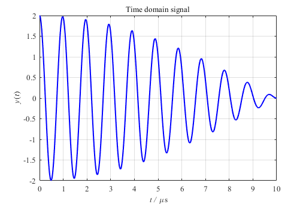
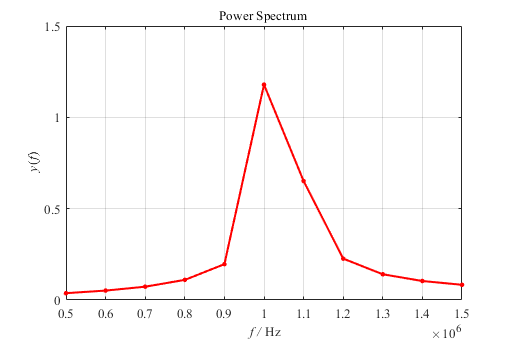
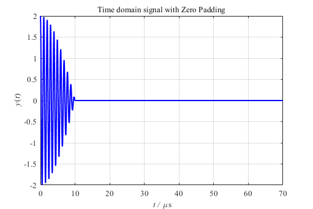
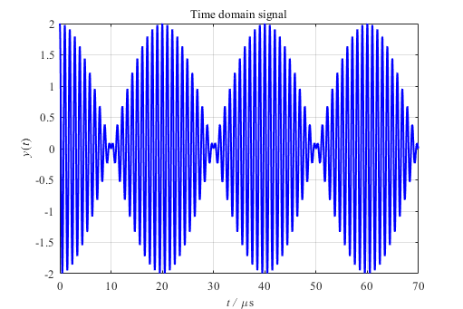
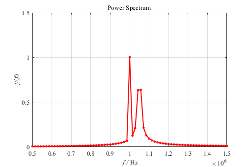
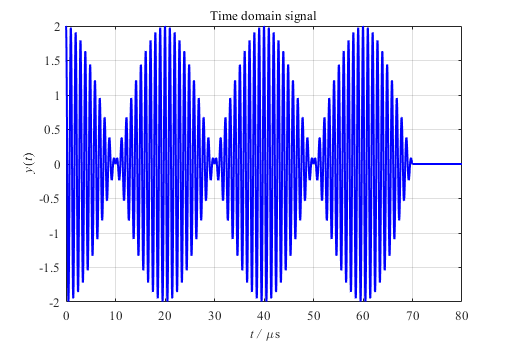
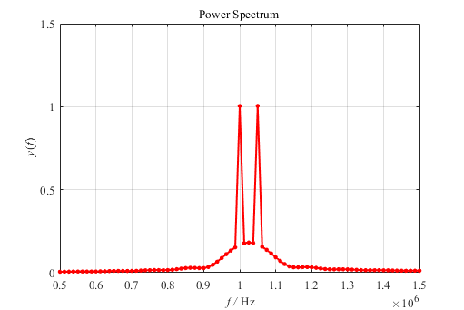
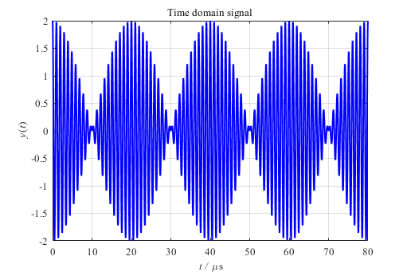
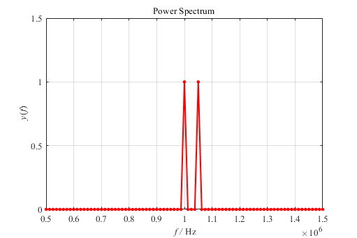

这里我以快速傅里叶变换（FFT）为对象举实例进行解释。

另外，说明一下，用MATLAB做FFT并不要求数据点个数必须为以2为基数的整数次方。之所以很多资料上说控制数据点数为以2为基数的整数次方，是因为这样就能采用以2为基的FFT算法，提升运算性能。

如果数据点数不是以2为基数的整数次方，处理方法有两种，一种是在原始数据开头或末尾补零，即将数据补到以2为基数的整数次方，<B>这是“补零”的一个用处</B>；第二种是采用以任意数为基数的FFT算法。

而MATLAB的 $fft(x,N)$ 函数在参数  $N$  正好就是数据 $x$ 的长度，但又不是以2为基数的整数次方时，并不会采用补零的方法，而应该是采用以任意数为基数的FFT算法（说“应该”是因为帮助文档里没有明确说明），这样也能得到很好的结果，只不过速度要稍稍慢了一些，以通常的计算量是体现不出来的。

##快速傅里叶变换 FFT
比如，现在我有一个信号，这个信号中仅包含两个正（余）弦波，一个是 $1 MHz$ ，一个是 $1.05 MHz$  ，即 $x = cos(2\pi\times1000000t) + cos(2\pi\times1050000t)$ 。设定采样频率为 $F _s=100 MHz$ ，如果采 $1000$ 个点，那么时域信号的时长就有 $10 \mu s$。

<b>图1. 1000个数据点
</b>

如果，直接对这$1000$个数据点其做快速傅里叶变换，将得到频谱图：

<b>图2. 1000个数据点做FFT的频谱
</b>

可以发现，频谱点稀疏，在$1 MHz$ 附近根本无法将 $1 MHz$ 和 $1.05 MHz$  的两个频率分开。

## 频率分辨率
发现频率成分无法被区分开来，第一反应应该就是：频率分辨率不够。那么，如何提高频率分辨率呢？首先要清楚，这里存在两种类型的频率分辨率。

一种叫波形分辨率，其由原始数据的时间长度决定：

$$\Delta R _w=\frac{1}{T}\tag{1}$$

另一种可以称之为视觉分辨率或[FFT分辨率](http://www.bitweenie.com/listings/fft-zero-padding/)，其由采样频率和参与FFT的数据点数决定：

$$\Delta R _{fft}=\frac{F _s}{N _{fft}}\tag{2}$$

之所以要区分，就是因为后面要进行“补零”的操作。如果不补零，直接对原始数据做FFT，那么这两种分辨率是相等的。

例如上面，有：

$$\Delta R _w=\frac{1}{10\mu s}=\Delta R _{fft}=\frac{100MHz}{1000}=100kHz\tag{3}$$

## 补零
那么，如果现在在原始数据点后补零会有什么效果呢？假设在这 $1000$ 个原始数据点后面再补充零达到 $7000$ 个点，那么数据变成了：

<b>图3. 7000个补零后数据点
</b>

此时对其做快速傅里叶变换，结果如下：

<b>图4. 7000个补零后数据点做FFT的频谱
</b>

可以发现，频谱点密集了不少，但是在 $1 MHz$ 附近依然无法将 $1 MHz$ 和 $1.05 MHz$  的两个频率成分分开。这是因为从式 $(1)$ 可以看出，波形分辨率只与原始数据的时长 $T$ 有关，而与参与FFT的数据点数无关。所以，虽然补了很多零，但波形分辨率依然为：$\Delta R _w=\frac{1}{10\mu s}=100kHz$  该分辨率大于 $1 MHz$ 和 $1.05 MHz$  这两个频率成分之间的距离 $50 kHz$ 。这就好比用筛子分黄豆和大米，分辨率就好像是筛子上孔的大小，如果筛子的孔太大了，就没有办法把这两者分开。

而[“时域补零相当于频域插值”](https://ccrma.stanford.edu/~jos/dft/Zero_Padding_Theorem_Spectral.html)，也就是说，补零操作增加了频域的插值点数，让频域曲线看起来更加光滑，也就是增加了FFT频率分辨率，注意式 $(2)$ 所示，<B>这是“补零”的另一个原因</B>。

## 频谱泄漏
显然，根据上面的分析可知，在采样频率不变的情况下，要想将  $1 MHz$ 和 $1.05 MHz$ 这两个频率成分分析出来，光靠“补零”是不够的，必须要改变波形分辨率，也就是要延长原始数据的时长。现在以相同的采样频率对信号采 $7000$ 个点作为原始信号：

<b>图5. 7000个数据点
</b>

对其做快速傅里叶变换，结果如下：

<b>图6. 7000个数据点做FFT的频谱
</b>

因为此时的波形分辨率为： $\Delta R _w=\frac{1}{70\mu s}\approx14kHz$ ，小于  $1 MHz$ 和 $1.05 MHz$ 这两个频率成分之间的距离 $50 kHz$ ，所以可以看出有两个明显的峰值。

但是会发现$1 MHz$  对应的幅值为1，与原始信号中该频率成分的幅值一致，但 $1.05 MHz$对应的幅值明显低于$1$，但是其周边的点上却都有不小的幅值，这就是所谓的频谱泄露，因为数据点的个数影响，使得在$1 MHz$  处有谱线存在，但在 $1.05 MHz$ 处没有谱线存在，使测量结果偏离实际值 ,同时在实际频率点的能量分散到两侧的其它频率点上，并出现一些幅值较小的假谱。

为了解决这个问题，可以设法使得谱线同时经过$1 MHz$ 和 $1.05 MHz$ 这两个频率点，找到他们的公约数。

如果原始数据不变，在后面再补充 $1000$  个零点：

<b>图7. 8000个补零后数据点
</b>

那么FFT分辨率就是 $12.5kHz$ ，是这两个频率的公约数， $1 MHz=80\times12.5kHz$ ； $1.05 MHz=84\times12.5kHz$ ，所以谱线同时经过  $1 MHz$ 和 $1.05 MHz$ 这两个频率点。

对其做快速傅里叶变换，结果如下：

<b>图8. 8000个补零后数据点做FFT的频谱
</b>

会发现 $1 MHz$ 和 $1.05 MHz$对应的幅值均为$1$，与原始信号一致。这也是一种补零操作带来的影响。

图8 中会有一些旁瓣出现，这是因为补零影响了原始信号，如果，直接采$8000$个点作为原始数据，即将程序中的$L0$改为 $8000$ ，那么有：

<b>图9. 8000个数据点
</b>

并对其做FFT，结果如下

<b>图10. 8000个数据点做FFT的频谱
</b>

这样就不存在补零带来的误差了。